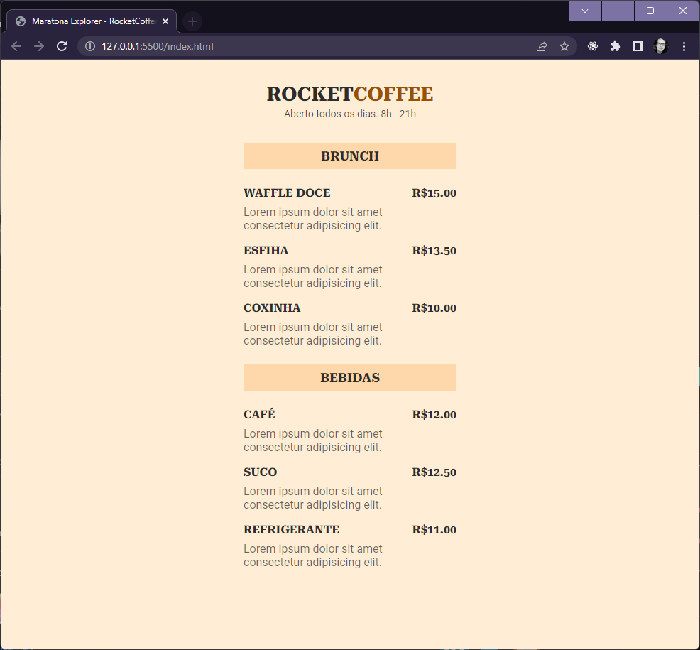

<h1 style="margin-bottom: 40px">Maratona Explorer - RocketCoffee</h1>

  
Projeto desenvolvido no evento gratuito Maratona Explorer - RocketCoffee, <a href="https://www.rocketseat.com.br/"> Rocketseat</a>

<a href="https://www.figma.com/file/yfxid1sCErg4mrKFGMicV3/RocketCoffee-(Community)?node-id=0%3A1&t=Z0q9PfOUNoT77Kr3-1">Projeto Figma</a>

  <h2 style="margin-top: 30px">🛠️ Tech Stack</h2>
  

  
Figma

  
HTML

  
CSS

  <h2 style="margin-top: 30px">🔗 Github Pages</h2>
  

  <a href="https://raszanin.github.io/rocketcoffee/">Maratona Explorer - Github Pages</a>

  <h2 style="margin-top: 30px">👀 Preview</h2>
  

  

